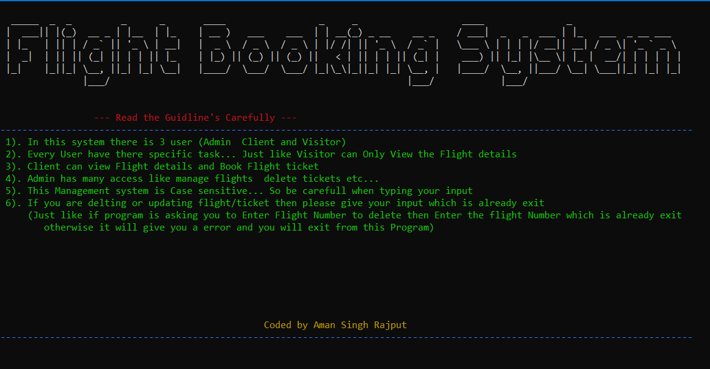
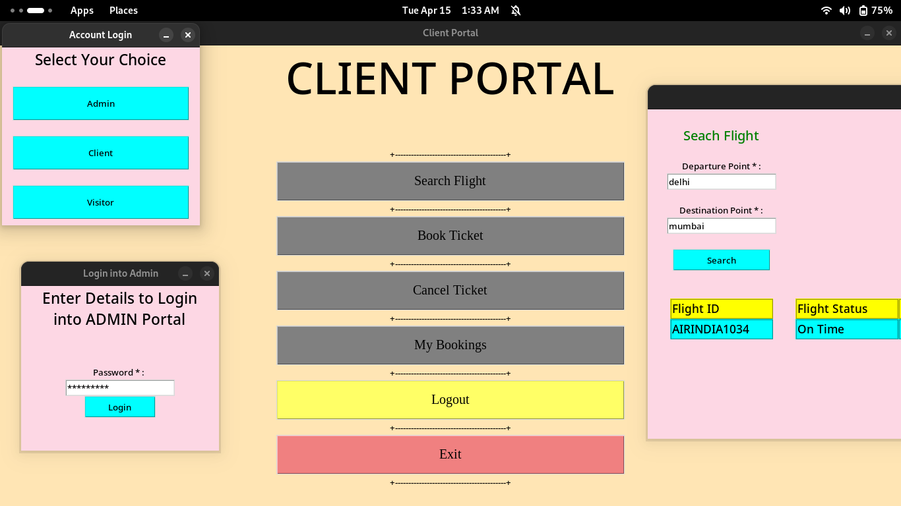

# Flight Booking System
This project is a comprehensive Flight Booking System designed to simplify the process of booking, searching, and canceling flights. It is implemented in two versions: a Terminal-Based System and a GUI-Based System, catering to different user preferences. Both versions leverage Python for backend logic and MySQL for database management, ensuring robust and efficient data handling.

The Terminal-Based System incorporates a voice assistant and vibrant color schemes to enhance user interaction, while the GUI-Based System provides an intuitive graphical interface using Python's Tkinter library. These systems are designed to be user-friendly and efficient, making them suitable for both novice and experienced users.

This repository serves as a practical demonstration of integrating Python programming with database management, showcasing real-world applications of software development concepts. It is an ideal project for students and developers looking to explore Python, Tkinter, and MySQL in a cohesive and meaningful way.

> **Note:** This code is optimized for Windows environments. Some features may not work as expected on Linux or macOS.

## This repository having two Flight Booking Systems,
## --> First is Terminal Based
## --> Second is GUI Based

## Terminal Based Flight Booking System
In this system, Voice Assistant and Colorfull colors are used for better user experience.  
> Requirements of this System is - 
- Python 3.x installed on your system.
- MySQL Database installed and configured.
- Required Python libraries: `mysql-connector-python`, `colorama`, and `pyttsx3`.

## GUI Based Flight Booking System
This system is made using Python Tkinter and MySQL Database.  
> Requirements of this System is -
- Python 3.x installed on your system.
- MySQL Database installed and configured.
- Required Python libraries: `mysql-connector-python`, `tkinter`, and `ttk`.

### Features of the Terminal Based System:
- Users can book a flight by entering:
    - Destination
    - Boarding location
    - Last 4 digits of citizenship number
    - Class (Economy, Premium Economy, Business, First Class)
    - Day of travel
    - Flight time
- Users can search for flights by providing:
    - Boarding location
    - Destination
    - Day of travel
- Users can cancel a flight by entering:
    - Last 4 digits of citizenship number
    - Class
    - Boarding location

### Additional Information:
- This system uses an external SQLite database to store user data permanently.
- It provides guidelines to help users navigate the system effectively.
- The system is efficient and saves time by simplifying flight booking, searching, and cancellation processes.
- This project is part of the 2nd semester BCA curriculum at my college.

## Screenshots

### Terminal-Based System

### GUI-Based System

These screenshots provide a visual representation of the two systems, showcasing their interfaces and functionality.
